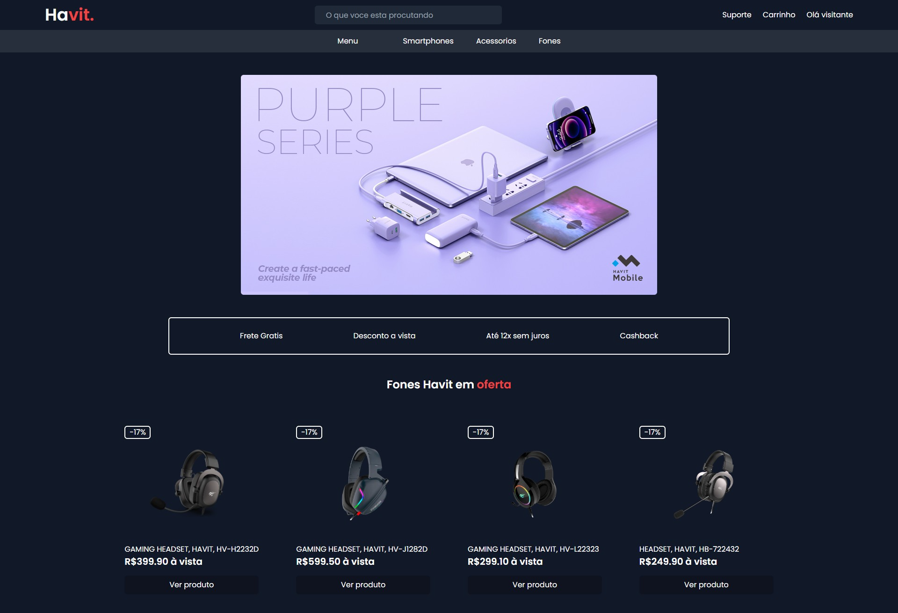
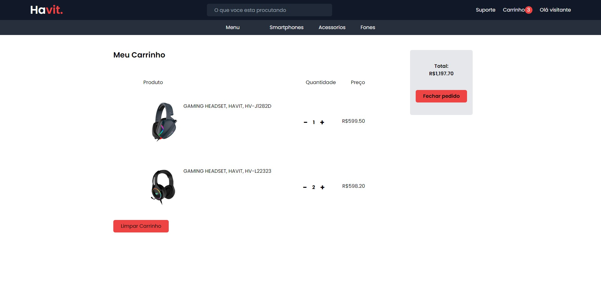

# E-commerce - Havit

E-commerce da marca de fones Havit, feito com Vite, React e Tailwind utilizando Chec.io como CMS.
 

# 📸 Fotos

# 💻 O Projeto

O projeto é um E-commerce da marca de fones Havit, feito com Vite, React e Tailwind utilizando Chec.io como CMS. Com funcionalidades de produtos no carrinho, finalização de pedido e checkout utilizando a gate do próprio chec.io.

- TailwindCSS foi utilizado pra desenvolver a interface, trabalhando também com a responsividade;
- Como CMS foi utilizado o CommerceJS / Chec.io. tratando todos os produtos e o carrinho.

# 🚀 Tecnologias

#### ✔️ ReactJS

#### ✔️ ViteJS

#### ✔️ TailwindCSS

#### ✔️ CommerceJS
